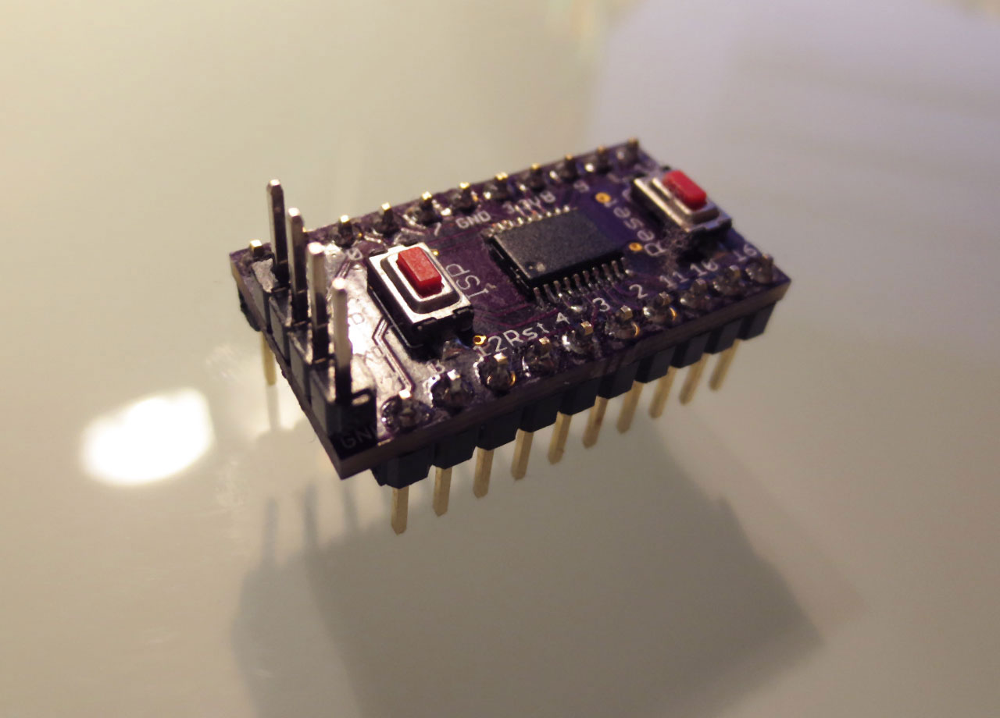
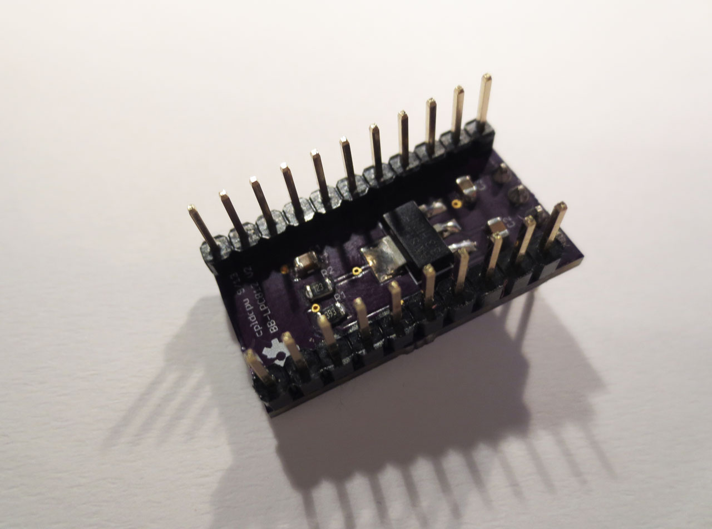
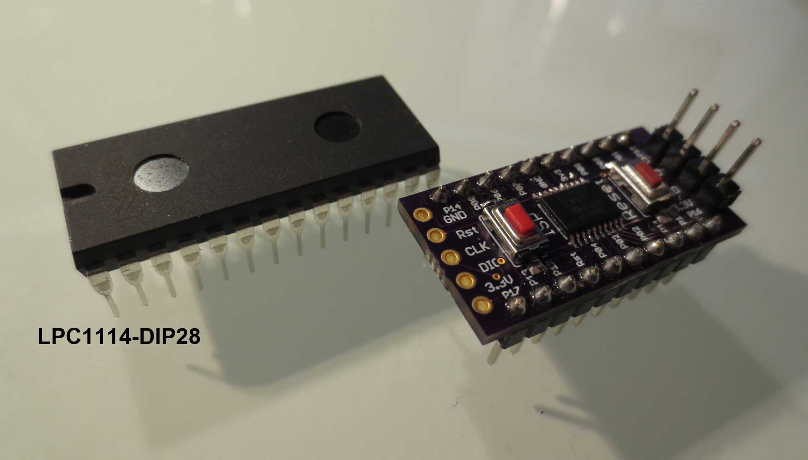
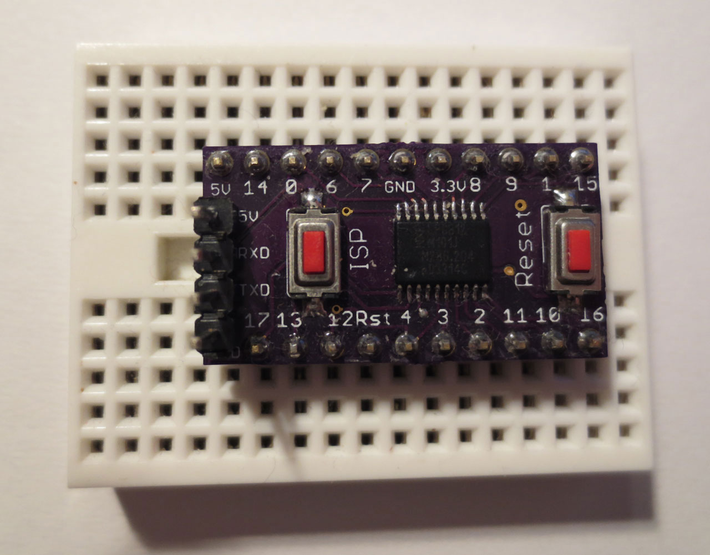

LPC812breakout
==============

Breakout Board for the NXP LPC812M101JPH20 microcontroller. Includes push buttons for reset and activating the serial bootloader. 
The board has an integrated 500mA 3.3V LDO to supply both the MCU and connected devices from the USB port. 

The four pins on the top side (5V,RX,TX,GND) can be used to connect a cheap USB to serial adapter (<$2 on ebay) and program the device via the internal bootloader using FlashMagic.

 * FlashMagic can be downloaded [here](http://www.flashmagictool.com/).
 * Developer environemt and LPC800 datasheets by NXP can be found  [here](http://www.lpcware.com/content/device/lpc800).

The entire board with LPC812 is smaller than a DIP LPC1114. See below for size comparison.

Bonus: Eagle Library for all LPC800 parts

[Shared design at OSH Park](http://oshpark.com/shared_projects/rQra0bCX)

Status
======

 - 2013/09/17 Untested. Board ordered at OSH park
 - 2013/09/29 Designed revision 2
 - 2013/10/?? Version 2 board received, built and tested. Everything works as intended.
 
## Top side ##

## Bottom ##

## Size comparison of first version to LPC1114 ##

## On breadboard ##

